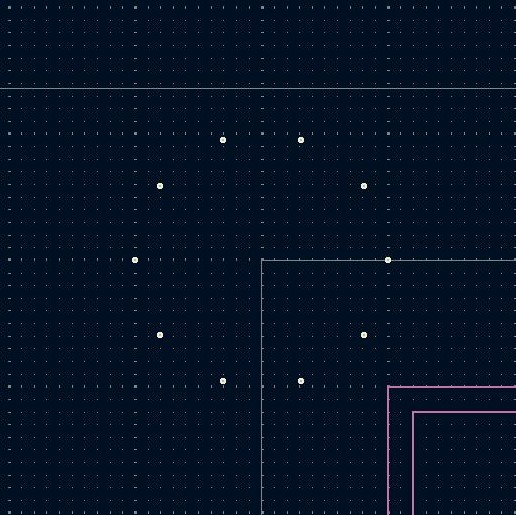

# kicadpy

Kicad Scripting toolbox.

It enables the easy usage of the scripting capabilites of Kicad.
It is based on Kicad's scripting python API.

It is still in its infant state and will undergo many changes and restructuring until the first stable version.

---

# Setup of kicadpy

The following steps will show you how to set up kicadpy.

1.  Clone the repository in a directory of your choice
    ``` Bash
    cd ~
    git clone https://github.com/polymurph/kicadpy 
    ```
    
2.  Copy the absolute directory path of the newly cloned kicadpy
    repo.

3.  Find the ```PyShell_pcbnew_startup.py``` file inside the Kicad
    application directory.

> [!TIP]
>     For Windows the ```PyShell_pcbnew_startup.py``` file is normally located under ```~\AppData\Roaming\kicad\8.0```.
>     For Linux it is under```~/.config/kicad/8.0/PyShell_pcbnew_startup.py```.

Open it up and insert the following code snippet.

    ``` Python
    import sys
    # the absolute file path to the kicadpy repo
    kicadpy_dir = '~/AbsPathTo/kicadpy/'
    sys.path.append(kicadpy_dir)
    import kicadpy as kp
    sys.path.append(kp.getProjectPath())
    ```
    
Replace the 
    
```~/AbsPathTo/kicadpy/``` with the prevoius copied absolute path to kicadpy.

This code will append the kicadpy to the system paths at startup of the Kicad Console. It creates a link sothat kicadpy is callable.

3.  Now lets test the implementation by opening up the kicad project and opening
    up the layout. Inside the
    layout editor open the console. In the output test you should see the message ```Info: Kicadpy is ready to be used``` pop up.

----

# How to use

## interactive Scripting inside the kicad console

TODO: explain how its done. Give some examples with pictures etc.

## Creating a script for the layout

Let's say you want to create a script which places 10 vias in a
circular pattern around a given center point. The following steps will show you how this can be done.
This example uses the following file structure as a demonstration.

```
YourProjectName (root)
├── .git
└── YourKicadProjectFolder
    ├── file1.kicad_pcb
    ├── file2.sch
    ├── file3.pro
    └── file4.lib
```


1.  Create a python file inside the folder ```YourKicadProjectFolder``` .
    In this case we name it ```layoutScript.py```
    Your folder structure should look as shown below.
    ```
    YourProjectName (root)
    ├── .git
    └── YourKicadProjectFolder
        ├── file1.kicad_pcb
        ├── file2.sch
        ├── file3.pro
        ├── file4.lib
        └── layoutScript.py
    ```
    This file will contain the python script for your layout.
2.  Open the file ```layoutScript.py``` and add the following code
    snippet.
    ```Python
    import kicadpy as kp

    kp.via.placeCircularArray(
        0,      # centerX_mm
        0,      # centerY_mm
        10,     # radius_mm
        0.2,    # drillDiameter_mm
        0.5,    # width_mm
        0,      # startAngle_DEG
        360,    # endAngle_DEG
        10)     # n_vias

    kp.layoutRefresh()
    ```
3.  Save and close the file.
4.  Now open up the layout and open up the console. Inside the console execute
    the script as followed.
    ```Python
    exec(open(r"AbsolutePathTo\YourProjectName\YourKicadProjectFolder\layoutScript.py").read())
    ```
    After execution the layout should look like this.
    
    

    

---

# FAQ

## Questions related to Kicad

### How to remove silkscreen from footprint

[link](https://maskset.net/kicad-pcbnew-scripting-removing-ref-des-from-silk-screen.html)

### How to execute a script?


```exec(open('<file name>.py').read())```

### How to install Python modules for Kicad Scripting?

[Reddid source](https://www.reddit.com/r/KiCad/comments/unl7s1/how_to_install_python_packages_for_kicad_scripting/)


For Windows go to the folder where Kicad program files are places on your system. In the designated folder open the command promt. There you can run ```pip install <module name>```

### How to create custom DRC rules

Inside the PCB editor go to the board setup and there go under Design Rules to Custom rules. There open up the Syntax help and copy the entire content and paste it inside chatGPT. then thell Chat gpt to create e.g a clearance rule between the net class A and B of 5 mm fo all entitys. Copy paste the output of chatGPT into the DRC rules window.
This way of creating rules must be further investigatet for new methods and possibilities.

## Questions related to Python

### How to create a Python library

[How to create a Python library by Kia Eisinga](https://medium.com/analytics-vidhya/how-to-create-a-python-library-7d5aea80cc3f)

---

# Ideas

https://jeffmcbride.net/kicad-track-layout/

---

# Sources
https://docs.kicad.org/doxygen-python-7.0/index.html

[KiCad Developer Documentation](https://dev-docs.kicad.org/en/)
